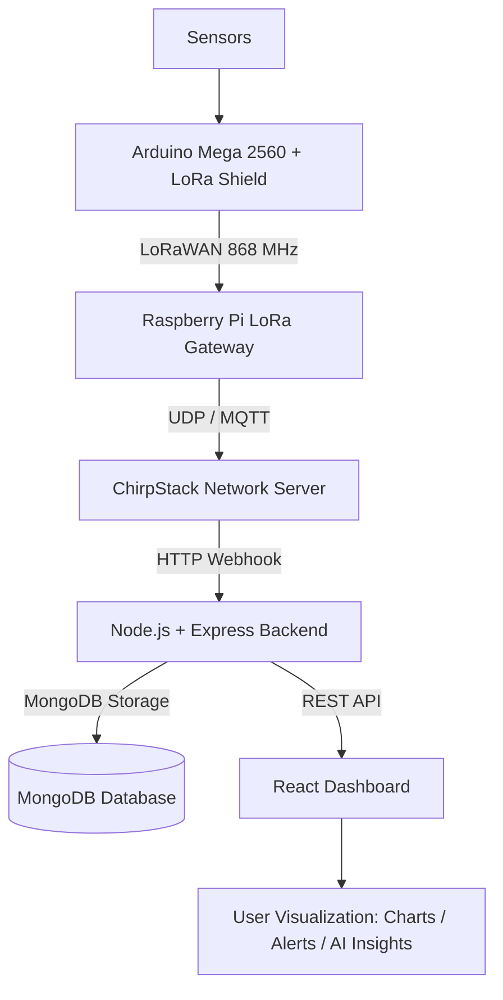

# 🐟🌿 AquaLip — Mini Aquaponic System with LoRaWAN

> A smart IoT-powered aquaponics monitoring system using LoRaWAN, ChirpStack, and a real-time web dashboard.  
> Developed during a summer internship at **WEDTECT Startup** (Hay Ons Pepinière, Sfax), originating from the **I2I Hackathon**.

---

## 📖 Overview

AquaLip combines **aquaculture** (fish farming) and **hydroponics** (soilless plant cultivation) in a closed-loop symbiotic system. To maintain healthy conditions for both fish and plants, water quality must be continuously monitored. This project delivers a full-stack IoT solution that:

- Collects water quality data via physical sensors
- Transmits it wirelessly using **LoRaWAN** (Long Range, Low Power)
- Processes and routes it through a **ChirpStack** network server
- Stores and visualizes it on a **custom web dashboard**

---

## 🎥 Workflow Demo

A full demonstration of the AquaLip system workflow:

📽️ [Watch the workflow demo](./workflow.mp4)

---

## 🏗️ System Architecture



---

## 🔧 Hardware Components

| Component | Model | Purpose | Est. Price (TND) |
|-----------|-------|---------|-----------------|
| Microcontroller | Arduino Mega 2560 | Sensor node & LoRa transmitter | — |
| LoRa Shield | SX1276 | LoRaWAN communication | — |
| Gateway | Raspberry Pi + LoRa HAT | Packet forwarding to ChirpStack | — |
| Temperature Sensor | DS18B20 | Water temperature monitoring | 6.70 |
| pH Sensor | E201-BNC + PH4502C Kit | Acidity/alkalinity monitoring | 85.00 |
| Water Level Sensor | HC-SR04 (Ultrasonic) | Fish tank water level | 5.20 × 2 |
| TDS Sensor | SEN0244 DFRobot | Total Dissolved Solids concentration | 69.00 |
| Light Sensor | LDR + LM393 | Light intensity monitoring | 5.50 |
| Water Pump | AD20P-1230C | Recirculation | 24.00 |
| **Total** | | | **~209.60 TND** |

---

## 📡 LoRaWAN Configuration

| Parameter | Value |
|-----------|-------|
| Frequency | 868.1 MHz (EU868) |
| Spreading Factor | SF7 |
| Bandwidth | 125 kHz |
| Coding Rate | 4/5 |
| Activation | OTAA (Over-The-Air) |
| UDP Port | 1701 → 1700 |

---

## 🖥️ Software Stack

### Firmware (Arduino)
- Language: C++ (Arduino IDE)
- Libraries: `LoRa.h`, `SPI.h`
- Transmits TDS readings every **5 seconds** over LoRa

### Gateway (Raspberry Pi)
- `single_chan_pkt_fwd` — Single-Channel Packet Forwarder
- `chirpstack-gateway-bridge` — Bridges UDP packets to MQTT

### Network Server
- **ChirpStack** (deployed via Docker)
- Handles device registration, OTAA activation, and adaptive data rate

### Backend
- **Node.js + Express**
- Receives JSON payloads from ChirpStack via **HTTP Webhook**
- Stores data in **MongoDB**
- Exposes REST API (`GET /api/data`, `POST /api/data`)

### Frontend / Dashboard
- **React + TypeScript**
- Charts: `Chart.js`, `Recharts`
- Hosted on **GitHub Pages**
- Features: real-time readings, historical graphs, threshold alerts, mobile-responsive UI

---

## 🚀 Getting Started

### Prerequisites

- Docker & Docker Compose
- Node.js ≥ 18
- Go ≥ 1.21 (for LWN Simulator)
- Arduino IDE
- Raspberry Pi with LoRa HAT

---

### 1. Deploy ChirpStack (Network Server)

```bash
git clone https://github.com/chirpstack/chirpstack-docker.git
cd chirpstack-docker
docker-compose up
# Access UI at http://localhost:8080
```

---

### 2. Run the LWN Simulator (Virtual Testing)

```bash
git clone https://github.com/UniCT-ARSLab/LWN-Simulator.git
cd LWN-Simulator
make && make build
./lwn-simulator
# Access UI at http://localhost:8000
```

---

### 3. Configure ChirpStack

1. **Create a Tenant** — workspace for your devices
2. **Create a Device Profile** — LoRaWAN version, region (EU868), OTAA
3. **Add Gateway** — paste MAC address from LWN simulator or Raspberry Pi
4. **Add Application** — logical grouping for sensor devices
5. **Add Device** — match DevEUI and AppKey with your node

---

### 4. Setup the Raspberry Pi Gateway

```bash
# Enable SPI
sudo raspi-config  # → Interfacing Options → SPI → Enable

# Install dependencies
sudo apt update && sudo apt install git build-essential
git clone https://github.com/WiringPi/WiringPi.git && cd WiringPi && ./build

# Install packet forwarder
git clone https://github.com/m2mlorawan/single_chan_pkt_fwd
cd single_chan_pkt_fwd
# Edit global_conf.json: set frequency=868100000, server IP, port=1701
make
sudo ./single_chan_pkt_fwd

# Install and configure ChirpStack Gateway Bridge
sudo apt install chirpstack-gateway-bridge
# Edit /etc/chirpstack-gateway-bridge/chirpstack-gateway-bridge.toml
sudo systemctl restart chirpstack-gateway-bridge
```

---

### 5. Flash Arduino Node

Open `arduino/lora_tds_sender.ino` in Arduino IDE and upload to Arduino Mega 2560.

Key pin mapping:

| Sensor | Pin |
|--------|-----|
| TDS Sensor | `A1` |
| pH Sensor | `A3` |
| Temperature (DS18B20) | `D5` |
| Ultrasonic TRIG | `D2` |
| Ultrasonic ECHO | `D3` |
| Relay (Water Pump) | `D8` |

---

### 6. Run the Backend

```bash
cd backend
npm install
npm start
# Server listens on port 3000
# POST http://<server-ip>:3000/api/data  ← ChirpStack webhook target
# GET  http://<server-ip>:3000/api/data  ← Frontend data source
```

---

### 7. Run the Frontend

```bash
cd frontend
npm install
npm run dev

# Or deploy to GitHub Pages:
npm run build && npm run deploy
```

---

## 📊 Dashboard Features

- **Real-time Monitoring** — pH, Temperature, Dissolved Oxygen, Water Level, TDS, Light Intensity
- **Historical Trends** — Line and bar charts with time-series data
- **Threshold Alerts** — Automated warnings when parameters go out of range
- **AI Recommendations** — Actionable insights based on sensor readings
- **Mobile Responsive** — Works on desktop and mobile

---

## 🌱 Aquaponics Optimal Parameters

| Parameter | Optimal Range |
|-----------|--------------|
| pH | 6.8 – 7.2 |
| Temperature | 18 – 30 °C |
| Dissolved Oxygen | > 6 mg/L |
| TDS | 300 – 700 ppm |
| Water Level | System-defined |

---

## 🔮 Future Work

- Scale to larger aquaponic installations
- Automated nutrient dosing via relay control
- Machine learning for predictive water quality analysis
- Multi-gateway deployment for wider coverage
- Mobile app (iOS / Android)

---

## 📄 References

1. MDPI — *Aquaponics: A Sustainable Path to Food Sovereignty and Enhanced Water Use Efficiency*
2. The Things Network — [What are LoRa and LoRaWAN?](https://www.thethingsnetwork.org/docs/lorawan/what-is-lorawan/)
3. Wikipedia — [LoRa](https://en.wikipedia.org/wiki/LoRa)

---

## 📜 License

This project was developed as part of a summer internship at **WEDTECT Startup** in collaboration with the **Faculty of Sciences of Sfax**.

---

*"Sustainable food production through the power of IoT and smart aquaponics."* 🌊
